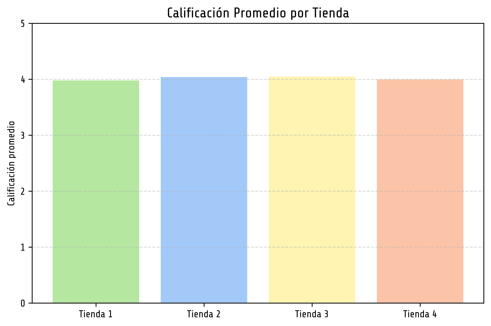
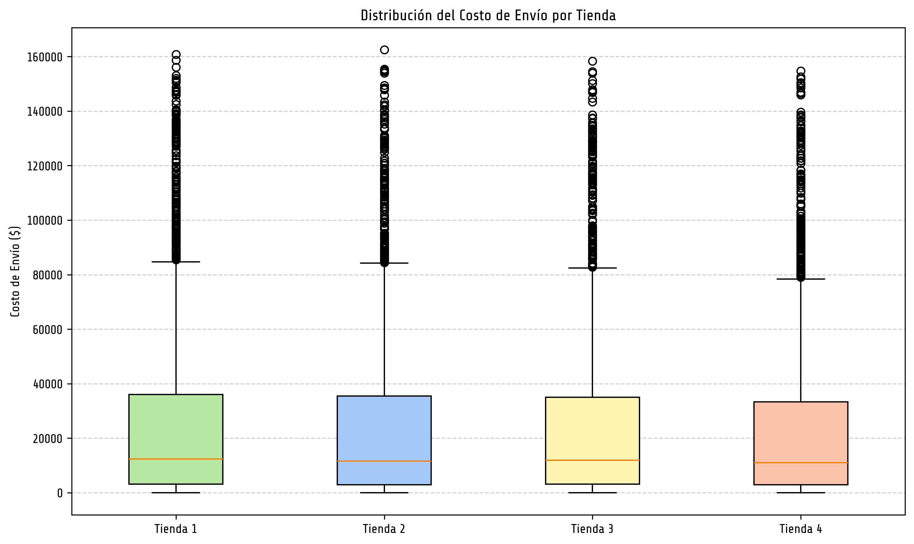

# Análisis de Tiendas - Recomendación para el Sr. Juan

Este proyecto realiza un análisis completo de datos de ventas, calificaciones y costos en 4 tiendas distintas, con el objetivo de determinar cuál es la mejor opción para que el Sr. Juan venda sus productos. Como parte del Challenge 1 de Data Science de Alura Latam.

Alumna: Laura Berenice Luna Reyes

---

## 📊 Resumen del análisis

Se consideraron múltiples factores:

- Ingresos brutos y netos por tienda (los ingresos netos se tomaron considerando la columna de precio - costo de envío)
- Categorías de productos más y menos vendidas.
- Calificación promedio de los clientes.
- Productos más y menos vendidos.
- Costo de envío promedio y valores atípicos.
- Relación entre precio y costo de envío.

---

## 📈 Visualizaciones

### Ventas brutas y netas
En este gráfico podemos observar que la Tienda con mayores ingresos tanto brutos como netos es la Tienda 1, mientras que en ambos casos la menot es la Tienda 4, lo que podría indicar que la tienda 4 podríoa tener menor demanda o mayor costo de envío en los ingresos netos.

### Categorías más populares por tienda
Para el caso de las categorías podemos observar que los productos más populares son los muebles, electrónicos y juguetes en las 4 Tiendas, pero de acuerdo a la información que obtuvimos la tienda que mayor es la Tienda 4 con 1269 ventas. La Tienda 1 y Tienda 2 concentran sus ventas en pocas categorías, mostrando especialización mientras que la Tienda 4 tiene una distribución más dispersa en varias categorías, aunque con menor volumen general después de las 3 categorías populares.

### Categorías por tienda (agrupadas)

### Calificación promedio por tienda
De las 4 tiendas solo la tienda 4 tiene las calificaciones más bajas, lo que podría reflejar problemas en experiencia o calidad, teniendo un calificación de 3.8, por otro lado la Tienda 3 es la mejor valorada (promedio > 4.5), lo cual indica alta valoración por parte de sus clientes.

### Productos más y menos vendidos
La Tienda 1 depende de sus 3 productos estrella, los Microondas, TV y Armarios. Visualizando los gráficos donde los colores fuertes indican los productos más vendidos y los claros los menos vendidos podemos visualizar que algunos productos que son muy vendidos en una tienda, son el caso contrario en otra tienda, por ejemplo en Tienda 1 los Microondas son muy populares mientras que en la Tienda 4 son de lo menos vendido, sería recomendable que el señor Juan especificara en que tipo de negocio o artículos le gustaría especializarse si es el caso.

### Distribución del costo de envío (Boxplot)
Los costos de envío por tienda no varian mucho pero la Tienda 3 y Tienda 4 tienen costos de envío más estables y bajos. Tienda 4 muestra mayor número de valores atípicos y costos elevados, lo cual puede afectar la experiencia del cliente. Sería importante analizar las ubicaciones de las tiendas y las paqueterías que utilizan para enviar sus productos a menores precios.

### Relación entre precio y costo de envío
En las 4 tiendas presentamos una relación postiva que nos indica que a mayor precio del producto, mayor costo del envío, aunque la mayoría de compras se centra en la parte de bajos precios y bajos costos de envio

---

## 📌 Conclusiones y Recomendación

Tras analizar todas las variables, se concluye que la **Tienda 1** es la mejor opción para que el Sr. Juan venda sus productos. Algunas de sus ventajas clave:
- Alto volumen de ventas y productos populares.
- Calificación promedio elevada de los clientes.
- Menor cantidad de valores atípicos, sus costos promedio por producto son más estables, los valores "Atípico" son productos con altos valores de precio.

