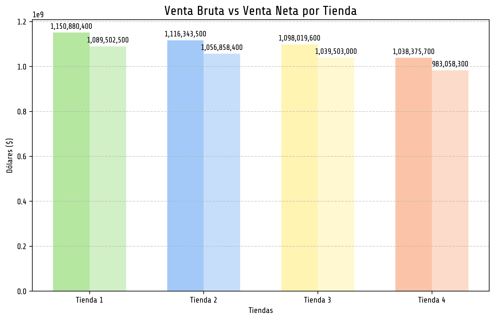
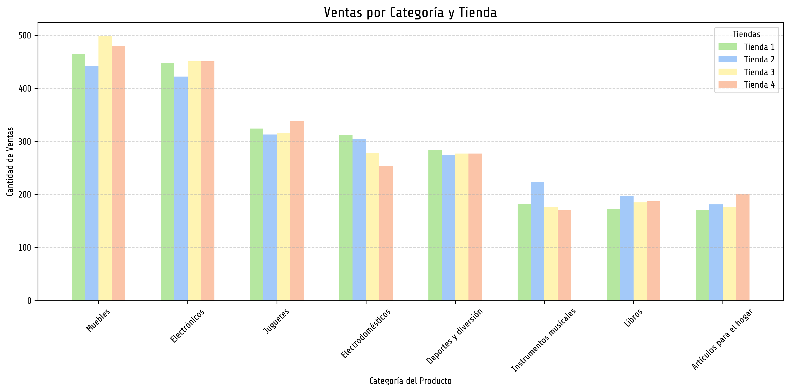
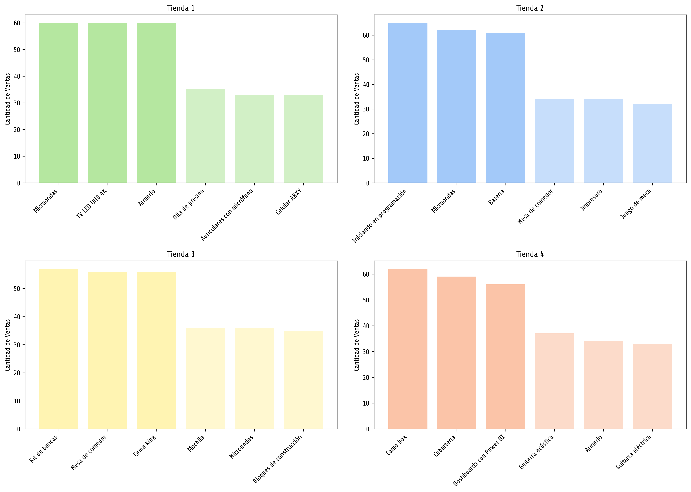

# Análisis de Tiendas - Recomendación para el Sr. Juan

Este proyecto realiza un análisis completo de datos de ventas, calificaciones y costos en 4 tiendas distintas, con el objetivo de determinar cuál es la mejor opción para que el Sr. Juan venda sus productos. Como parte del Challenge 1 de Data Science de Alura Latam.

Alumna: Laura Berenice Luna Reyes

---

## 📊 Resumen del análisis

Se consideraron múltiples factores:

- Ingresos brutos y netos por tienda (los ingresos netos se tomaron considerando la columna de precio - costo de envío)
- Categorías de productos más y menos vendidas.
- Calificación promedio de los clientes.
- Productos más y menos vendidos.
- Costo de envío promedio y valores atípicos.
- Relación entre precio y costo de envío.

---

## 📈 Visualizaciones

### Ventas brutas y netas

### Categorías más populares por tienda

### Categorías por tienda (agrupadas)

### Calificación promedio por tienda

### Productos más y menos vendidos

### Distribución del costo de envío (Boxplot)

### Relación entre precio y costo de envío

---

## 📌 Conclusiones y Recomendación

Tras analizar todas las variables, se concluye que la **Tienda 1** es la mejor opción para que el Sr. Juan venda sus productos. Algunas de sus ventajas clave:
- Alto volumen de ventas y productos populares.
- Calificación promedio elevada de los clientes.
- Menor cantidad de valores atípicos, sus costos promedio por producto son más estables, los valores "Atípico" son productos con altos valores de precio.

